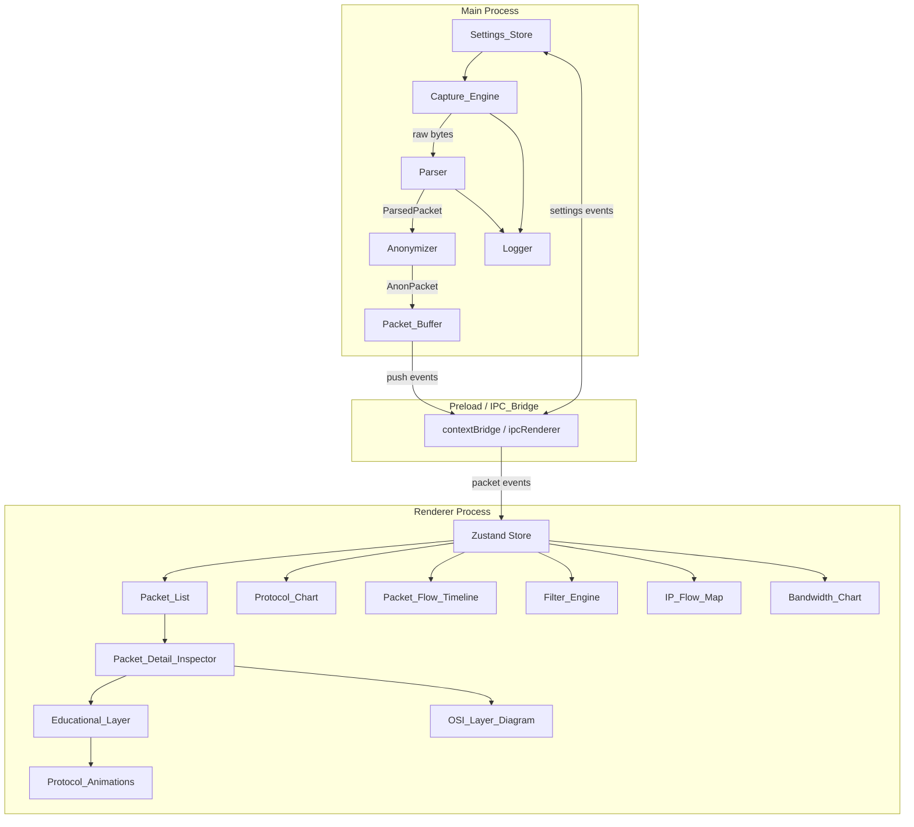

# Design Document — NetVis Core

## Overview

NetVis is a cross-platform Electron + React + TypeScript desktop application for educational network packet visualization. It targets beginner networking students who need to capture live traffic, load PCAP files, and understand protocol behavior through interactive visualizations and guided challenges.

The application is structured around a strict security boundary: the Electron main process owns all privileged operations (packet capture, file I/O, parsing, anonymization, logging), and the React renderer owns all UI concerns. Communication crosses the boundary only through a narrow, explicitly declared IPC contract enforced by Electron's `contextBridge`.

### Key Design Goals

- Unidirectional data flow (ARCH-05): `Capture_Engine → Parser → Anonymizer → Packet_Buffer → IPC_Bridge → Renderer`
- Security by default: `nodeIntegration: false`, `contextIsolation: true`, no remote URLs (ARCH-01–04)
- Educational clarity: every packet field has a plain-English explanation; protocol colors are consistent everywhere
- Phase-gated delivery: Phase 1 (core visualizations) ships before Phase 2 (advanced visualizations)

---

## Architecture

### Component Diagram



### Process Boundary Rules

| Rule                              | Enforcement                                                                |
| --------------------------------- | -------------------------------------------------------------------------- |
| Only anonymized packets cross IPC | Anonymizer runs before `Packet_Buffer.push()`                              |
| No Node.js in renderer            | `nodeIntegration: false`, `contextIsolation: true`                         |
| No remote URLs                    | `webPreferences.allowRunningInsecureContent: false`; CSP header            |
| Typed IPC contract                | Shared `ipc-types.ts` imported by both preload and renderer                |
| Settings persisted in main        | `Settings_Store` lives in main process; renderer reads/writes via IPC only |

---

## Components and Interfaces

### Main Process Components

#### Capture_Engine

The capture layer has exactly two modes. They are not fallbacks for each other — they are separate features that share the same downstream pipeline.

```
MODE 1: Live Capture
  User selects interface → CapSource (cap library) → RawPacket { captureMode: 'live' }
  → Shared Worker Pipeline: Parser → Anonymizer → postMessage
  → Main thread: Packet_Buffer.push() → IPC batch → Renderer

MODE 2: File Import
  User selects .pcap/.pcapng → PcapFileSource (pcap-parser) → RawPacket { captureMode: 'file' }
  → Shared Worker Pipeline: Parser → Anonymizer → postMessage
  → Main thread: Packet_Buffer.push() → IPC batch → Renderer
```

**Key invariant:** both modes produce identical `RawPacket` objects. Everything below the capture boundary — parsing, anonymization, buffering, IPC, visualization — is completely unaware of which mode produced a packet.

**Library responsibilities:**

| Library       | Job                                                                         | When used                |
| ------------- | --------------------------------------------------------------------------- | ------------------------ |
| `cap`         | Open a live network interface; stream raw Ethernet frames via libpcap/Npcap | User starts live capture |
| `pcap-parser` | Read `.pcap` / `.pcapng` files as a stream; emit packet records             | User loads a file        |

Neither library does protocol parsing. Both produce raw bytes. The `Parser` component does all protocol dissection.

**Fallback policy:** if `cap` fails to load (missing Npcap on Windows, insufficient permissions), live capture is disabled and the UI shows an actionable error. File import continues to work independently — it has no dependency on `cap` or system permissions. The user is never silently switched between modes.

---

##### PacketSource — Adapter Interface

Decouples `CaptureController` from specific libraries. Both `CapSource` and `PcapFileSource` implement this interface.

```typescript
/**
 * Uniform interface for any packet source — live or file.
 * The CaptureController only talks to PacketSource — never to cap or
 * pcap-parser directly.
 */
interface PacketSource {
  /** Begin emitting packets. Idempotent if already started. */
  start(): Promise<void>
  /** Stop emitting packets and release resources. Safe to call multiple times. Resolves within 500 ms. */
  stop(): Promise<void>
  onPacket(handler: (packet: RawPacket) => void): void
  onError(handler: (err: CaptureError) => void): void
  onStopped(handler: () => void): void
}
```

---

##### RawPacket — Common Interface

```typescript
/**
 * A raw, unprocessed packet from either cap (live) or pcap-parser (file).
 * Contains NO protocol interpretation — that is entirely the Parser's job.
 * INVARIANT: data is always a copy. Never a reference to a shared buffer.
 */
interface RawPacket {
  /**
   * Unix timestamp in milliseconds with sub-millisecond precision where available.
   * - Live (cap):  Date.now() at callback time
   * - File:        seconds * 1000 + floor(microseconds / 1000)
   * NOTE: live and file timestamps are NOT directly comparable.
   */
  timestamp: number
  /** Interface name (live) or filename only — not full path (file). Display only. */
  sourceId: string
  /** Whether this packet came from a live interface or a file. */
  captureMode: 'live' | 'file'
  /** Raw bytes of the frame. Always a fresh copy. */
  data: Buffer
  /** Original wire length in bytes. May differ from data.length if snaplen < frame size. */
  length: number
  /**
   * libpcap link-layer type. Tells the Parser how to begin decoding.
   * Common values: 1 = LINKTYPE_ETHERNET, 0 = LINKTYPE_NULL, 113 = LINKTYPE_LINUX_SLL
   * The Parser MUST handle LINKTYPE_ETHERNET (1).
   * For any other value, mark protocol: 'OTHER' and preserve byte length.
   */
  linkType: number
}
```

---

##### CapSource — Live Capture Implementation

```typescript
import { Cap } from 'cap'

/**
 * PacketSource implementation using the cap library.
 * Must run inside a worker_threads Worker — never on the main thread.
 */
class CapSource implements PacketSource {
  private cap: Cap | null = null
  private buffer = Buffer.alloc(65535) // max Ethernet frame size
  private droppedTruncatedCount = 0

  constructor(private readonly iface: string) {}

  async start(): Promise<void> {
    const device = Cap.findDevice(this.iface)
    if (!device) {
      this.errorHandler(
        mapError(
          new Error(`Interface "${this.iface}" not found`),
          'INTERFACE_NOT_FOUND',
          this.iface
        )
      )
      return
    }
    this.cap = new Cap()
    const linkType = this.cap.open(device, '', 10 * 1024 * 1024, this.buffer)

    this.cap.on('packet', (nbytes: number, truncated: boolean) => {
      if (truncated) {
        this.droppedTruncatedCount++
        return
      }
      // CRITICAL: copy bytes immediately — cap reuses this.buffer on next callback
      const data = Buffer.from(this.buffer.slice(0, nbytes))
      this.packetHandler({
        timestamp: Date.now(),
        sourceId: this.iface,
        captureMode: 'live',
        data,
        length: nbytes,
        linkType
      })
    })
    this.cap.on('error', (err: Error) =>
      this.errorHandler(mapError(err, 'INTERFACE_LOST', this.iface))
    )
  }

  async stop(): Promise<void> {
    if (!this.cap) return // idempotent
    try {
      this.cap.close()
    } catch {
      /* interface may already be gone */
    }
    this.cap = null
    this.stoppedHandler()
  }

  get truncatedDropCount(): number {
    return this.droppedTruncatedCount
  }

  private packetHandler: (p: RawPacket) => void = () => {}
  private errorHandler: (e: CaptureError) => void = () => {}
  private stoppedHandler: () => void = () => {}
  onPacket(h: (p: RawPacket) => void) {
    this.packetHandler = h
  }
  onError(h: (e: CaptureError) => void) {
    this.errorHandler = h
  }
  onStopped(h: () => void) {
    this.stoppedHandler = h
  }
}
```

---

##### PcapFileSource — File Import Implementation

```typescript
import * as pcapParser from 'pcap-parser'
import * as fs from 'fs'
import * as path from 'path'

/**
 * PacketSource implementation using pcap-parser.
 * Streams .pcap and .pcapng files without loading them fully into memory.
 * Does NOT require Npcap, libpcap, or elevated permissions.
 */
class PcapFileSource implements PacketSource {
  private stream: fs.ReadStream | null = null
  private stopped = false

  constructor(private readonly filePath: string) {}

  async start(): Promise<void> {
    if (!fs.existsSync(this.filePath)) {
      this.errorHandler(mapError(new Error(`File not found: ${this.filePath}`), 'FILE_NOT_FOUND'))
      return
    }
    this.stream = fs.createReadStream(this.filePath)
    const parser = pcapParser.parse(this.stream)

    parser.on('packet', (pkt: pcapParser.Packet) => {
      if (this.stopped) return
      // Correct timestamp: include microseconds — do NOT use seconds * 1000 only
      const timestamp =
        pkt.header.timestampSeconds * 1000 + Math.floor(pkt.header.timestampMicroseconds / 1000)
      this.packetHandler({
        timestamp,
        sourceId: path.basename(this.filePath),
        captureMode: 'file',
        data: pkt.data,
        length: pkt.header.capturedLength,
        linkType: parser.globalHeader.linkLayerType
      })
    })
    parser.on('end', () => this.stoppedHandler())
    parser.on('error', (err: Error) => this.errorHandler(mapError(err, 'FILE_INVALID_FORMAT')))
  }

  async stop(): Promise<void> {
    if (this.stopped) return // idempotent
    this.stopped = true
    this.stream?.destroy()
    this.stream = null
    this.stoppedHandler()
  }

  private packetHandler: (p: RawPacket) => void = () => {}
  private errorHandler: (e: CaptureError) => void = () => {}
  private stoppedHandler: () => void = () => {}
  onPacket(h: (p: RawPacket) => void) {
    this.packetHandler = h
  }
  onError(h: (e: CaptureError) => void) {
    this.errorHandler = h
  }
  onStopped(h: () => void) {
    this.stoppedHandler = h
  }
}
```

---

##### SimulatedReplaySource — Streaming Replay

Simulated replay re-emits a file's packets with inter-packet delays matching original capture timing, scaled by a speed multiplier.

**Critical design rule:** replay operates in **streaming mode**. It does NOT preload the entire file into memory. For a 100 MB PCAP file that could mean hundreds of thousands of packets in RAM — violating the 500 MB memory ceiling (PERF-04). At most 2 packets exist in memory at any given moment.

```typescript
class SimulatedReplaySource implements PacketSource {
  private stream: fs.ReadStream | null = null
  private timer: ReturnType<typeof setTimeout> | null = null
  private stopped = false
  private prevTimestamp: number | null = null

  constructor(
    private readonly filePath: string,
    private readonly speed: SpeedMultiplier
  ) {}

  async start(): Promise<void> {
    if (!fs.existsSync(this.filePath)) {
      this.errorHandler(mapError(new Error(`File not found: ${this.filePath}`), 'FILE_NOT_FOUND'))
      return
    }
    this.stream = fs.createReadStream(this.filePath)
    const parser = pcapParser.parse(this.stream)
    parser.pause() // control drip rate via setTimeout

    const scheduleNext = (raw: RawPacket) => {
      if (this.stopped) return
      if (this.prevTimestamp === null) {
        this.packetHandler(raw)
        this.prevTimestamp = raw.timestamp
        parser.resume()
      } else {
        const delay = Math.min(Math.max((raw.timestamp - this.prevTimestamp) / this.speed, 0), 2000)
        this.timer = setTimeout(() => {
          if (this.stopped) return
          this.packetHandler(raw)
          this.prevTimestamp = raw.timestamp
          parser.resume()
        }, delay)
      }
    }

    parser.on('packet', (pkt: pcapParser.Packet) => {
      parser.pause()
      const timestamp =
        pkt.header.timestampSeconds * 1000 + Math.floor(pkt.header.timestampMicroseconds / 1000)
      scheduleNext({
        timestamp,
        sourceId: path.basename(this.filePath),
        captureMode: 'file',
        data: pkt.data,
        length: pkt.header.capturedLength,
        linkType: parser.globalHeader.linkLayerType
      })
    })
    parser.on('end', () => this.stoppedHandler())
    parser.on('error', (err: Error) => this.errorHandler(mapError(err, 'FILE_INVALID_FORMAT')))
  }

  async stop(): Promise<void> {
    if (this.stopped) return // idempotent
    this.stopped = true
    if (this.timer) clearTimeout(this.timer)
    this.stream?.destroy()
    this.stream = null
    this.stoppedHandler()
  }

  private packetHandler: (p: RawPacket) => void = () => {}
  private errorHandler: (e: CaptureError) => void = () => {}
  private stoppedHandler: () => void = () => {}
  onPacket(h: (p: RawPacket) => void) {
    this.packetHandler = h
  }
  onError(h: (e: CaptureError) => void) {
    this.errorHandler = h
  }
  onStopped(h: () => void) {
    this.stoppedHandler = h
  }
}
```

---

##### CaptureController — Mode Switcher

Lives in the main process. Creates the appropriate `PacketSource`, wires up the worker, and enforces single-source-at-a-time.

```typescript
type ControllerState = 'idle' | 'live' | 'file' | 'simulated'

class CaptureController {
  private source: PacketSource | null = null
  private state: ControllerState = 'idle'

  constructor(
    private readonly onPacket: (p: RawPacket) => void,
    private readonly onError: (e: CaptureError) => void,
    private readonly onStopped: () => void,
    private readonly onStatus: (s: ControllerState) => void
  ) {}

  async startLive(iface: string): Promise<void> {
    this.guardIdle('startLive')
    this.source = new CapSource(iface)
    this.wireSource()
    await this.source.start()
    this.state = 'live'
    this.onStatus('live')
  }

  async startFile(filePath: string): Promise<void> {
    this.guardIdle('startFile')
    this.source = new PcapFileSource(filePath)
    this.wireSource()
    await this.source.start()
    this.state = 'file'
    this.onStatus('file')
  }

  async startSimulated(filePath: string, speed: SpeedMultiplier): Promise<void> {
    this.guardIdle('startSimulated')
    this.source = new SimulatedReplaySource(filePath, speed)
    this.wireSource()
    await this.source.start()
    this.state = 'simulated'
    this.onStatus('simulated')
  }

  async stop(): Promise<void> {
    if (this.state === 'idle') return // idempotent
    await this.source?.stop()
    this.source = null
    this.state = 'idle'
    this.onStatus('idle')
  }

  get currentState(): ControllerState {
    return this.state
  }

  private wireSource(): void {
    this.source!.onPacket(this.onPacket)
    this.source!.onError(this.onError)
    this.source!.onStopped(() => {
      this.state = 'idle'
      this.source = null
      this.onStopped()
    })
  }

  private guardIdle(caller: string): void {
    if (this.state !== 'idle')
      throw mapError(new Error(`Cannot call ${caller} while state is "${this.state}"`), 'UNKNOWN')
  }
}
```

---

##### IPC Batching

At 1,000 pps, one IPC message per packet = 1,000 `ipcMain.send()` calls/second — enough to degrade UI performance significantly. The fix: accumulate packets and flush in groups.

```typescript
/**
 * Flush policy: every 50 ms OR when batch reaches 100 packets — whichever first.
 * Result: ≤20 IPC calls/second regardless of packet rate; latency ≤100 ms (PERF-02).
 * IPC channel changes from packet:new (single) to packet:batch (array).
 */
class IpcBatcher {
  private static readonly FLUSH_INTERVAL_MS = 50
  private static readonly MAX_BATCH_SIZE = 100
  private batch: AnonPacket[] = []
  private timer: ReturnType<typeof setInterval> | null = null

  constructor(private readonly send: (packets: AnonPacket[]) => void) {}

  start(): void {
    this.timer = setInterval(() => this.flush(), IpcBatcher.FLUSH_INTERVAL_MS)
  }
  stop(): void {
    if (this.timer) clearInterval(this.timer)
    this.flush()
  }

  push(packet: AnonPacket): void {
    this.batch.push(packet)
    if (this.batch.length >= IpcBatcher.MAX_BATCH_SIZE) this.flush()
  }

  private flush(): void {
    if (this.batch.length === 0) return
    this.send(this.batch.splice(0))
  }
}
```

The Zustand store gains an `addPackets(ps: AnonPacket[])` action to process batches in a single state update.

---

##### Worker Supervision

```typescript
/**
 * Restarts the capture worker on unexpected exit.
 * Does NOT restart if stop() was called intentionally.
 */
class WorkerSupervisor {
  private worker: Worker | null = null
  private intentional = false

  constructor(private readonly workerPath: string) {}

  start(): Worker {
    this.intentional = false
    this.worker = new Worker(this.workerPath)
    this.worker.on('exit', (code) => {
      if (this.intentional) return
      Logger.warn('CaptureWorker', `Worker exited unexpectedly (code ${code}), restarting`)
      setTimeout(() => this.start(), 500)
    })
    return this.worker
  }

  stop(): void {
    this.intentional = true
    this.worker?.terminate()
    this.worker = null
  }
}
```

---

##### Error Normalization

```typescript
interface CaptureError {
  code: CaptureErrorCode
  message: string // plain-English, shown directly in UI
  platformHint?: string // OS-specific fix instructions
  cause?: Error // original error — logged, never shown to user
}

type CaptureErrorCode =
  | 'PERMISSION_DENIED' // no admin/root privileges
  | 'INTERFACE_NOT_FOUND' // named interface does not exist
  | 'INTERFACE_LOST' // interface disappeared during active capture
  | 'FILE_NOT_FOUND' // file path does not exist
  | 'FILE_INVALID_FORMAT' // not a valid PCAP or PCAPNG file
  | 'LIBRARY_UNAVAILABLE' // cap failed to load
  | 'DRAIN_TIMEOUT' // stop drain exceeded 500 ms
  | 'UNKNOWN'

function mapError(err: Error, code: CaptureErrorCode = 'UNKNOWN', context?: string): CaptureError {
  // Builds user-facing message and optional platform hint from code + context
  // Platform hints: Windows → "Run as Administrator, install Npcap"
  //                 Linux   → "sudo setcap cap_net_raw,cap_net_admin=eip ..."
  //                 macOS   → "Run with sudo or grant terminal full disk access"
  return {
    code,
    message: buildUserMessage(err, code, context),
    platformHint: buildPlatformHint(code),
    cause: err
  }
}
```

---

##### Worker Thread — Internal State Machine

```
States:  IDLE → ACTIVE → IDLE

Messages main → worker:
  { type: 'start-live',      iface: string }
  { type: 'start-file',      filePath: string }
  { type: 'start-simulated', filePath: string, speed: SpeedMultiplier }
  { type: 'stop' }

Messages worker → main:
  { type: 'packet-batch', packets: RawPacket[] }
  { type: 'stopped' }
  { type: 'error',        error: CaptureError }
  { type: 'metrics',      truncatedDropCount: number }
```

Any `start-*` message received while state is `ACTIVE` is rejected with `CaptureError { code: 'UNKNOWN' }`.

---

##### Threading Model Summary

| Stage                  | Thread   | Reason                                                          |
| ---------------------- | -------- | --------------------------------------------------------------- |
| Interface enumeration  | Worker   | `cap` is a native addon; keep off main thread                   |
| Live capture callbacks | Worker   | Up to 1,000+ callbacks/second                                   |
| File streaming         | Worker   | I/O and parsing load                                            |
| Parser + Anonymizer    | Worker   | Hot path — run alongside capture                                |
| IPC batching           | Main     | Receives `AnonPacket[]` from worker, batches, sends to renderer |
| Packet_Buffer          | Main     | Single owner; no concurrent access issues                       |
| Visualization + UI     | Renderer | React owns the DOM                                              |

---

##### Capture_Engine Public Interface

```typescript
interface CaptureEngine {
  getInterfaces(): Promise<NetworkInterface[]>
  startCapture(iface: string): Promise<void>
  stopCapture(): Promise<void> // resolves within 500 ms; drains in-flight packets first
  startFile(filePath: string): Promise<void>
  startSimulated(pcapPath: string, speedMultiplier: SpeedMultiplier): Promise<void>
  on(event: 'packet', handler: (raw: RawPacket) => void): void
  on(event: 'error', handler: (err: CaptureError) => void): void
  on(event: 'stopped', handler: () => void): void
}
```

#### Parser

Pure synchronous TypeScript module. Accepts a `RawPacket` and returns a `ParsedPacket`. Decodes layers in order: Ethernet → IPv4/IPv6 → TCP/UDP/ICMP/DNS. Unknown or malformed layers are annotated rather than dropped (Req 3.3, 3.4).

```typescript
interface Parser {
  parse(raw: RawPacket): ParsedPacket
  print(packet: ParsedPacket): Buffer // Pretty_Printer — produces valid PCAP record bytes
}
```

#### Anonymizer

Runs synchronously after parsing. Holds a session-scoped HMAC key generated at startup. Replaces transport-layer payload bytes with `sha256(key || payload)[0..7]` hex. Anonymizes DNS answer IPs while preserving query names (Req 4.1, 4.4).

```typescript
interface Anonymizer {
  anonymize(packet: ParsedPacket): AnonPacket
}
```

#### Packet_Buffer

In-memory ring buffer. Default capacity 10,000 packets; configurable 1,000–100,000 (Req 12.1). Implemented as a fixed-size circular array with head/tail pointers. Emits `'change'` events consumed by the IPC push loop.

```typescript
interface PacketBuffer {
  push(packet: AnonPacket): void
  getAll(): AnonPacket[]
  getRange(start: number, end: number): AnonPacket[]
  clear(): void
  readonly size: number
  readonly capacity: number
  on(event: 'change', handler: () => void): void
  on(event: 'overflow', handler: (dropped: number) => void): void
}
```

#### Logger

Wraps `pino` (replaces `winston` — lower overhead, structured JSON output by default). Writes JSON lines to `app.getPath('userData')/netvis.log`. Rotates at 10 MB, retains 2 rotated files (Req 13.5). Production builds suppress DEBUG entries (Req 13.3).

**IPC schema validation:** `zod` is used in the preload and main-process IPC handlers to validate all incoming message payloads before processing. Invalid payloads are rejected with a structured error response rather than crashing.

#### Settings_Store

Persists user-configurable settings to `app.getPath('userData')/settings.json`. Loaded at startup and kept in memory; written on every mutation. Fills the design gap for Req 20 / `AdvancedSettingsPanel`.

```typescript
interface Settings {
  bufferCapacity: number // 1000–100000, default 10000
  theme: 'light' | 'dark' | 'system'
  welcomeSeen: boolean
  completedChallenges: string[]
  reducedMotion: boolean // mirrors OS preference; user can override
}

interface SettingsStore {
  get(): Settings
  set(patch: Partial<Settings>): void
  on(event: 'change', handler: (settings: Settings) => void): void
}
```

IPC channels added: `settings:get` (invoke) and `settings:set` (invoke). See Channel Inventory below.

---

### IPC Bridge (Preload)

The preload script exposes a single `window.electronAPI` object via `contextBridge`. All channels are typed via a shared `src/shared/ipc-types.ts` module.

#### Channel Inventory

| Direction       | Channel                  | Payload                                    | Description                                             |
| --------------- | ------------------------ | ------------------------------------------ | ------------------------------------------------------- |
| Renderer → Main | `capture:getInterfaces`  | —                                          | Returns `NetworkInterface[]`                            |
| Renderer → Main | `capture:start`          | `{ iface: string }`                        | Start live capture                                      |
| Renderer → Main | `capture:stop`           | —                                          | Stop capture                                            |
| Renderer → Main | `capture:startSimulated` | `{ path: string; speed: SpeedMultiplier }` | Start simulated replay                                  |
| Renderer → Main | `pcap:import`            | —                                          | Open file dialog, parse, populate buffer (instant load) |
| Renderer → Main | `pcap:startFile`         | `{ path: string }`                         | Stream file through pipeline as `captureMode: 'file'`   |
| Renderer → Main | `pcap:export`            | —                                          | Open save dialog, write buffer to PCAP                  |
| Renderer → Main | `buffer:clear`           | —                                          | Clear Packet_Buffer                                     |
| Renderer → Main | `buffer:setCapacity`     | `{ capacity: number }`                     | Resize buffer                                           |
| Renderer → Main | `buffer:getAll`          | —                                          | Returns `AnonPacket[]` (initial load)                   |
| Renderer → Main | `log:openFolder`         | —                                          | Open log directory in OS file explorer                  |
| Renderer → Main | `settings:get`           | —                                          | Returns current `Settings` object                       |
| Renderer → Main | `settings:set`           | `Partial<Settings>`                        | Persists setting patch; returns updated `Settings`      |
| Main → Renderer | `packet:batch`           | `AnonPacket[]`                             | Push batch of new packets (50 ms window, max 100)       |
| Main → Renderer | `capture:status`         | `CaptureStatus`                            | Status updates (active, stopped, error)                 |
| Main → Renderer | `buffer:overflow`        | `{ dropped: number }`                      | Buffer overflow notification                            |
| Main → Renderer | `buffer:stats`           | `BufferStats`                              | Occupancy update (≤500 ms interval)                     |

#### Preload API Shape

```typescript
interface ElectronAPI {
  // invoke (renderer → main, returns promise)
  getInterfaces(): Promise<NetworkInterface[]>
  startCapture(iface: string): Promise<void>
  stopCapture(): Promise<void>
  startSimulated(path: string, speed: SpeedMultiplier): Promise<void>
  importPcap(): Promise<ImportResult>
  exportPcap(): Promise<ExportResult>
  clearBuffer(): Promise<void>
  setBufferCapacity(capacity: number): Promise<void>
  getAllPackets(): Promise<AnonPacket[]>
  openLogFolder(): Promise<void>
  getSettings(): Promise<Settings>
  setSettings(patch: Partial<Settings>): Promise<Settings>
  // on (main → renderer push)
  onPacket(handler: (p: AnonPacket) => void): Unsubscribe
  onCaptureStatus(handler: (s: CaptureStatus) => void): Unsubscribe
  onBufferOverflow(handler: (info: { dropped: number }) => void): Unsubscribe
  onBufferStats(handler: (stats: BufferStats) => void): Unsubscribe
  onPacketBatch(handler: (ps: AnonPacket[]) => void): Unsubscribe
}
```

---

### Renderer Architecture

#### Component Tree

```
App
├── ThemeProvider (MUI)
├── AppShell
│   ├── Toolbar
│   │   ├── InterfaceSelector
│   │   ├── CaptureControls (Start/Stop/Simulated)
│   │   ├── FilterBar
│   │   ├── ThemeToggle
│   │   └── CaptureActiveIndicator (pulsing dot)
│   ├── StatusBar
│   │   ├── CaptureStatusMessage
│   │   ├── BufferOccupancy
│   │   └── FileInfo
│   └── MainLayout
│       ├── VisualizationPane (≥40% width at 1280px+)
│       │   ├── Protocol_Chart
│       │   ├── Packet_Flow_Timeline
│       │   ├── [Phase 2] OSI_Layer_Diagram
│       │   ├── [Phase 2] IP_Flow_Map
│       │   └── [Phase 2] Bandwidth_Chart
│       └── DetailPane
│           ├── Packet_List (virtualized — see Packet_List §)
│           ├── Packet_Detail_Inspector
│           └── Educational_Layer
│               ├── FieldExplanationPanel
│               ├── ChallengePanel
│               └── [Phase 2] Protocol_Animations
├── WelcomeScreen (first-launch overlay)
└── AdvancedSettingsPanel  (see Contextual Help §)
```

#### Zustand Store Shape

```typescript
interface NetVisStore {
  // Packet data
  packets: AnonPacket[]
  selectedPacketId: string | null
  bufferStats: BufferStats

  // Capture state
  captureStatus: CaptureStatus
  interfaces: NetworkInterface[]
  activeInterface: string | null

  // Filter
  filterExpression: string
  filterError: string | null
  filteredPackets: AnonPacket[] // derived, recomputed on packets/filterExpression change

  // UI
  theme: 'light' | 'dark' | 'system'
  focusVisualization: boolean
  welcomeSeen: boolean

  // Challenge
  activeChallengeId: string | null
  completedChallengeIds: string[]

  // Actions
  addPacket(p: AnonPacket): void
  addPackets(ps: AnonPacket[]): void // batch add from IpcBatcher
  setPackets(ps: AnonPacket[]): void
  clearPackets(): void
  selectPacket(id: string | null): void
  setFilter(expr: string): void
  setCaptureStatus(s: CaptureStatus): void
  setInterfaces(ifaces: NetworkInterface[]): void
  setTheme(t: 'light' | 'dark' | 'system'): void
  toggleFocusVisualization(): void
  activateChallenge(id: string): void
  completeChallenge(id: string): void
}
```

---

## Visualization Component Designs

### Phase 1

#### Protocol_Chart

- Library: Recharts `PieChart` / `Cell`
- Data: `Map<ProtocolName, number>` derived from `filteredPackets`
- Each segment colored by `PROTOCOL_COLORS[proto]`
- Label: protocol name + count + percentage
- Accessible data table rendered as `<table aria-label="Protocol distribution">` alongside the chart (Req 6.4)
- Updates within 500 ms of buffer change via Zustand subscription

#### Packet_Flow_Timeline

- Library: Recharts `BarChart`
- Data: 60 one-second buckets; each bucket stores `{ timestamp, counts: Map<Protocol, number> }`
- Bar color = dominant protocol color for that bucket (Req 22.3)
- Scrolls to keep latest bucket visible; x-axis shows HH:MM:SS labels
- Click handler calls `store.setFilter(timeRangeFilter(bucket))` (Req 22.4)
- Accessible data table (Req 22.5)
- Placeholder when empty (Req 22.6)

#### Packet_List (with Virtualization)

Rendering 100,000 raw DOM rows would block the browser's layout engine and make 30 fps impossible. The solution is windowed rendering — only the rows currently visible in the scroll viewport are mounted in the DOM.

- **Library:** `@tanstack/virtual` (`useVirtualizer` hook). Integrates cleanly with React state, supports variable-height rows (useful when a row is expanded).
- **Implementation pattern:**

```typescript
const rowVirtualizer = useVirtualizer({
  count: filteredPackets.length,
  getScrollElement: () => scrollContainerRef.current,
  estimateSize: () => 36, // px per row — 36px is the MUI TableRow default
  overscan: 10 // render 10 rows above/below viewport for smooth scroll
})
```

The outer `<div>` is set to `height: rowVirtualizer.getTotalSize()` so the scrollbar reflects the true document height. Only `rowVirtualizer.getVirtualItems()` are rendered. This reduces DOM nodes from ~100,000 to ~30 at any given time, keeping layout and paint costs constant regardless of buffer size.

**Performance budget:** at 1,000 pps with a 30-row viewport, the React reconciler processes at most 30 row diffs per 200 ms tick — comfortably within the 30 fps frame budget (33 ms per frame).

#### Packet_Detail_Inspector

- Custom React component; no chart library needed
- Renders `ParsedPacket.layers[]` as a collapsible tree using MUI `Accordion` or custom `TreeNode`
- Each layer node header colored by `PROTOCOL_COLORS[layer.protocol]`
- Expanded fields show: name, decoded value, byte offset
- Hex strip at bottom highlights byte range on field hover/focus (Req 23.5)
- Keyboard: arrow keys expand/collapse, Tab moves between fields (Req 23.6)
- **Slide-in animation:** 150–250 ms `transform: translateX` transition (Req 21.3)

### Phase 2

#### OSI_Layer_Diagram

- Custom React component; vertical stack of 7 labeled layer boxes
- Active layers (have a decoded header) rendered with `PROTOCOL_COLORS[proto]` background tint
- Inactive layers rendered with `opacity: 0.3`
- Click on active layer → `store.selectPacket` + expand corresponding PDI node (Req 26.4)
- Placeholder when no packet selected (Req 26.7)

#### IP_Flow_Map (D3 + React Integration Pattern)

D3's force-directed simulation mutates DOM nodes directly via `selection.attr()`, which conflicts with React's virtual DOM reconciler. The resolution is the "React renders structure, D3 animates positions" pattern:

- React renders `<svg>` with `<g>` nodes and `<line>` edges as static elements, keyed by node/edge ID. React owns the SVG structure and re-renders on data changes.
- A `useRef` holds the D3 simulation instance. The simulation is created once in `useEffect` and ticked externally.
- On each simulation tick, D3 writes `x`/`y` directly to a separate ref'd `<g>` element via `d3.select(ref.current).attr('transform', ...)`. React never re-renders on tick — only D3 updates those attributes.
- When `filteredPackets` changes, React re-renders the SVG structure (adds/removes nodes/edges), and a new simulation is initialized with the updated graph.

```typescript
useEffect(() => {
  const sim = d3
    .forceSimulation(nodes)
    .force(
      'link',
      d3.forceLink(edges).id((d) => d.id)
    )
    .force('charge', d3.forceManyBody().strength(-80))
    .force('center', d3.forceCenter(width / 2, height / 2))
    .on('tick', () => {
      // D3 writes directly to DOM refs — no React setState
      nodeGroupRef.current &&
        d3
          .select(nodeGroupRef.current)
          .selectAll('g.node')
          .attr('transform', (d) => `translate(${d.x},${d.y})`)
      edgeGroupRef.current &&
        d3
          .select(edgeGroupRef.current)
          .selectAll('line.edge')
          .attr('x1', (d) => d.source.x)
          .attr('y1', (d) => d.source.y)
          .attr('x2', (d) => d.target.x)
          .attr('y2', (d) => d.target.y)
    })
  return () => sim.stop() // cleanup on unmount / data change
}, [nodes, edges])
```

This avoids React re-renders on every simulation tick (60/s) while keeping node/edge creation fully declarative.

Additional behavior:

- Nodes: unique IP addresses; edges: packet pairs with thickness ∝ packet count
- Click node → `store.setFilter('src == IP || dst == IP')` (Req 27.3)
- Click edge → `store.setFilter('(src == A && dst == B) || (src == B && dst == A)')` (Req 27.4)
- Updates within 1 s of buffer change (Req 27.5)
- Accessible table alternative (Req 27.7)

#### Bandwidth_Chart

- Library: Recharts `AreaChart` (stacked)
- Data: same 1-second bucket structure as Packet_Flow_Timeline but accumulates bytes
- Each protocol area colored by `PROTOCOL_COLORS[proto]`
- Click region → time-range filter (Req 28.3)
- Accessible table alternative (Req 28.5)

#### Protocol_Animations

- Custom React component; two-endpoint SVG diagram
- Packet envelopes animated with CSS transitions (disabled under `prefers-reduced-motion`)
- Playback controls: play/pause/step-forward/step-back/restart (Req 29.4)
- Each step announces text description via `aria-live` region (Req 29.6)

---

## Animation Timing Constants

All animation durations are defined in a single constants file so they can be swapped in one place and zeroed out under `prefers-reduced-motion`.

```typescript
// src/renderer/src/constants/animations.ts
export const ANIMATION = {
  ROW_FADE_IN_MS: 200, // Req 21.1: new Packet_List row fade-in (150–300 ms range)
  CHART_TRANSITION_MS: 300, // Req 21.2: Protocol_Chart segment resize (200–400 ms range)
  PDI_SLIDE_IN_MS: 200, // Req 21.3: detail panel slide-in (150–250 ms range)
  CAPTURE_PULSE_MS: 900 // Req 21.4: CaptureActiveIndicator CSS keyframe duration
} as const
```

Under `prefers-reduced-motion`, these values are overridden to `0` via CSS custom properties:

```css
@media (prefers-reduced-motion: reduce) {
  :root {
    --anim-row-fade: 0ms;
    --anim-chart: 0ms;
    --anim-pdi-slide: 0ms;
    --anim-pulse: 0ms;
  }
}
```

### CaptureActiveIndicator

A pulsing colored dot in the toolbar visible WHILE capture is active (Req 21.4). Implemented as a `<span>` with a CSS `@keyframes` animation alternating `opacity` between `1` and `0.3` on a `CAPTURE_PULSE_MS` cycle. Under reduced motion, the dot is solid (no animation) but still visible. The dot carries `aria-label="Capture active"` with `role="status"`.

---

## Contextual Help Design

### Help Icon Data Model

Every non-obvious UI control has an associated help entry stored in `src/renderer/src/data/help-text.json`.

```typescript
interface HelpEntry {
  id: string // matches a `data-help-id` attribute on the control
  label: string // short name shown in tooltip title
  body: string // plain-English explanation, 1–3 sentences
}
```

Example entries:

```json
[
  {
    "id": "filter-bar",
    "label": "Packet Filter",
    "body": "Type an expression to show only matching packets. For example: proto == TCP shows only TCP packets. The full syntax is explained in the Help panel."
  },
  {
    "id": "buffer-capacity",
    "label": "Buffer Capacity",
    "body": "The maximum number of packets NetVis keeps in memory at once. When this limit is reached, the oldest packet is removed to make room for the newest one."
  },
  {
    "id": "simulated-speed",
    "label": "Replay Speed",
    "body": "Controls how fast a loaded PCAP file is replayed. 1× plays at the original capture speed; 5× plays five times faster."
  }
]
```

The `HelpIcon` component accepts a `helpId: string` prop, looks up the entry, and renders an MUI `Tooltip` with an `<IconButton aria-label="Help">` containing a `?` icon (Req 20.1).

### StatusBar Contextual Messages

The `CaptureStatusMessage` component shows context-sensitive text based on `captureStatus.state` (Req 20.3, 20.4):

| State                   | Message                                                           |
| ----------------------- | ----------------------------------------------------------------- |
| `idle` (no file loaded) | "Select an interface above and press Start, or load a PCAP file." |
| `idle` (file loaded)    | "File loaded — {n} packets. Press Start to begin a live capture." |
| `active`                | "Capturing on {iface} — {pps} packets/sec"                        |
| `simulated`             | "Replaying {filename} at {speed}×"                                |
| `error`                 | Error message from `captureStatus.message`                        |

### AdvancedSettingsPanel

A collapsible MUI `Drawer` (anchor `"right"`) opened by a gear icon in the Toolbar. Contains (Req 20.2):

| Setting         | Control                                       | Validation       |
| --------------- | --------------------------------------------- | ---------------- |
| Buffer Capacity | `<Slider>` min=1000 max=100000 step=1000      | Integer in range |
| Theme           | `<ToggleButtonGroup>` (Light / Dark / System) | —                |
| Replay Speed    | `<Select>` (0.5× / 1× / 2× / 5×)              | —                |
| Reduced Motion  | `<Switch>` (overrides OS preference)          | —                |
| Open Log Folder | `<Button>`                                    | —                |

All settings are persisted via `window.electronAPI.setSettings(patch)` on change. On panel open, the renderer calls `window.electronAPI.getSettings()` to populate current values.

---

## Filter Engine Design

### Grammar (from Req 9.1)

```
expression    ::= term ( ( "AND" | "OR" ) term )*
term          ::= [ "NOT" ] predicate
predicate     ::= field comparator value
field         ::= "proto" | "src" | "dst" | "port" | "len"
comparator    ::= "==" | "!=" | ">" | "<" | ">=" | "<="
value         ::= quoted-string | number | ip-address | protocol-name
protocol-name ::= "TCP" | "UDP" | "ICMP" | "DNS" | "ARP" | "OTHER"
quoted-string ::= '"' [^"]* '"'
number        ::= [0-9]+
ip-address    ::= ipv4-address | ipv6-address
```

### AST Node Types

```typescript
type FilterAST =
  | { kind: 'AND'; left: FilterAST; right: FilterAST }
  | { kind: 'OR'; left: FilterAST; right: FilterAST }
  | { kind: 'NOT'; operand: FilterAST }
  | { kind: 'PREDICATE'; field: Field; comparator: Comparator; value: FilterValue }

type Field = 'proto' | 'src' | 'dst' | 'port' | 'len'
type Comparator = '==' | '!=' | '>' | '<' | '>=' | '<='
type FilterValue =
  | { kind: 'string'; v: string }
  | { kind: 'number'; v: number }
  | { kind: 'ip'; v: string }
  | { kind: 'protocol'; v: ProtocolName }
```

### Implementation

- **Lexer**: single-pass tokenizer producing `Token[]`
- **Parser**: recursive descent; `parseExpression → parseTerm → parsePredicate`
- **Evaluator**: `evaluate(ast: FilterAST, packet: AnonPacket): boolean`
- Runs in the **main process** (not the renderer) — keeps the renderer lightweight and prevents UI thread blocking on large buffers
- Parse errors surface as `{ ok: false; error: string; position: number }` displayed inline (Req 9.4)
- Filter is read-only; never mutates `Packet_Buffer` (Req 9.5)

---

## Educational Layer Design

### Field Explanation Data Model

```typescript
interface FieldExplanation {
  protocol: ProtocolName
  field: string // e.g. "ttl"
  label: string // e.g. "Time to Live"
  symbolicValues?: Record<number | string, string> // e.g. { 1: "ICMP", 6: "TCP" }
  explanation: string // plain-English description
  byteOffset: number
  byteLength: number
}
```

Explanations are stored as a static JSON file (`src/renderer/src/data/field-explanations.json`) covering all fields listed in Req 10.2. The `Packet_Detail_Inspector` looks up explanations by `(protocol, field)` key.

### Challenge Data Model

```typescript
interface Challenge {
  id: string
  title: string
  description: string // goal description shown to user
  hint: string // revealed on demand
  successCriteria: ChallengeCriteria
  completionMessage: string
}

type ChallengeCriteria =
  | { kind: 'packetExists'; filter: string } // filter matches ≥1 packet
  | { kind: 'filterActive'; expression: string } // user has applied this filter
  | { kind: 'packetSelected'; filter: string } // selected packet matches filter
  | { kind: 'countAtLeast'; filter: string; n: number }
```

The five required challenges (Req 11.1):

1. TCP three-way handshake — find SYN, SYN-ACK, ACK packets
2. DNS query/response pair — find matching DNS ID
3. ICMP echo request/reply pair
4. Filter by port number — apply `port == <N>` filter
5. Compare packet lengths across protocols

Challenge evaluation runs on a 500 ms debounced interval while a challenge is active (Req 11.3). Completion state persisted to `localStorage` under key `netvis:completedChallenges` (Req 11.5).

---

## Visual Design System

### Color Tokens

```typescript
const PROTOCOL_COLORS: Record<ProtocolName, string> = {
  TCP: '#3B82F6', // blue
  UDP: '#10B981', // green
  ICMP: '#F59E0B', // amber
  DNS: '#8B5CF6', // purple
  ARP: '#EF4444', // red
  OTHER: '#6B7280' // gray
}
```

Protocol colors are invariant across light/dark mode (Req 18.2).

### MUI Theme Structure

```typescript
const baseTokens = {
  typography: {
    fontFamily: '"Inter", "Roboto", sans-serif',
    fontSize: 14,          // body minimum (Req 18.4)
    button: { fontSize: 13 },
  },
  spacing: 8,              // 8px base unit
  shape: { borderRadius: 6 },
}

const lightTheme = createTheme({ ...baseTokens, palette: { mode: 'light', ... } })
const darkTheme  = createTheme({ ...baseTokens, palette: { mode: 'dark',  ... } })
```

Theme is stored in Zustand (`theme: 'light' | 'dark' | 'system'`). On first launch, `window.matchMedia('(prefers-color-scheme: dark)')` determines the initial value (Req 18.3). A toolbar toggle overrides it (Req 18.6).

### Contrast and Accessibility

- All primary text surfaces maintain ≥4.5:1 contrast ratio (Req 18.5)
- Focus indicators: 2px solid outline, ≥3:1 contrast against adjacent color (Req 16.2)
- `prefers-reduced-motion` media query disables all CSS transitions and Recharts animations (Req 16.5, 21.5)

---

## Data Models

### Core TypeScript Interfaces

```typescript
// Raw packet from libpcap callback — see Capture_Engine § for full field documentation
interface RawPacket {
  timestamp: number // Unix ms with sub-ms precision
  sourceId: string // interface name (live) or filename only (file) — display only
  captureMode: 'live' | 'file'
  data: Buffer // raw frame bytes — always a fresh copy
  length: number // original wire length; may differ from data.length if snaplen < frame
  linkType: number // libpcap link-layer type (1=Ethernet, 0=NULL, 113=Linux SLL)
}

// One decoded protocol layer
interface ParsedLayer {
  protocol: ProtocolName
  fields: ParsedField[]
  error?: string // set if layer is malformed
  rawByteOffset: number
  rawByteLength: number
}

interface ParsedField {
  name: string
  label: string
  value: string | number
  byteOffset: number
  byteLength: number
}

// Full parsed packet (main process only)
interface ParsedPacket {
  id: string // uuid v4
  timestamp: number
  interface: string
  wireLength: number
  layers: ParsedLayer[]
}

// Anonymized packet (crosses IPC boundary)
interface AnonPacket {
  id: string
  timestamp: number
  interface: string
  wireLength: number
  layers: ParsedLayer[] // payload bytes replaced with pseudonym token
  srcAddress: string // top-level convenience fields for Packet_List
  dstAddress: string
  protocol: ProtocolName
  length: number
}

// Network interface descriptor
interface NetworkInterface {
  name: string
  displayName: string
  isUp: boolean
}

// Capture status
type CaptureStatus =
  | { state: 'idle' }
  | { state: 'active'; iface: string; startedAt: number; pps: number }
  | { state: 'file'; path: string; pps: number }
  | { state: 'simulated'; path: string; speed: SpeedMultiplier; pps: number }
  | { state: 'error'; message: string }
  | { state: 'stopped' }

type SpeedMultiplier = 0.5 | 1 | 2 | 5
type ProtocolName = 'TCP' | 'UDP' | 'ICMP' | 'DNS' | 'ARP' | 'IPv6' | 'OTHER'

interface BufferStats {
  count: number
  capacity: number
  percentage: number
}

interface ImportResult {
  ok: boolean
  packetCount?: number
  fileSizeBytes?: number
  error?: string
}

interface ExportResult {
  ok: boolean
  error?: string
}
```

---

## Build and Phase Gating Strategy

### Phase 1 Components (required for initial release, Req 30.1)

Build order: `Packet_List → Packet_Detail_Inspector → field tooltips → Protocol_Chart → Packet_Flow_Timeline`

Each component is gated by a feature flag `VITE_PHASE` in the build environment:

- `VITE_PHASE=1` — renders Phase 1 components only
- `VITE_PHASE=2` — renders all components

Phase 2 components render a `<PhasePlaceholder label="OSI Layer Diagram — coming soon" />` until `VITE_PHASE=2` (Req 30.4).

### Build Profiles

Three profiles are defined via `NODE_ENV` and Vite mode:

| Profile      | `NODE_ENV`    | Vite mode     | Behaviour                                                                                              |
| ------------ | ------------- | ------------- | ------------------------------------------------------------------------------------------------------ |
| `dev`        | `development` | `development` | Source maps on; DEBUG logs enabled; dev-only FPS overlay available via `Ctrl+Shift+D`; no minification |
| `staging`    | `production`  | `staging`     | Minified; source maps off; INFO+ logs only; `VITE_PHASE=1` enforced; used for pre-release testing      |
| `production` | `production`  | `production`  | Minified; source maps off; INFO+ logs only; `VITE_PHASE` from build arg; electron-builder packaging    |

The dev-only FPS/throughput overlay (toggled by `Ctrl+Shift+D`) is stripped from staging and production builds via a Vite define:

```typescript
// vite.config.ts
define: {
  __DEV_OVERLAY__: JSON.stringify(mode === 'development')
}
```

This satisfies PERF-01–04 verification during development without shipping debug UI to users.

### Dependency Installation

```
npm install cap                # live capture — libpcap / Npcap binding
npm install pcap-parser        # file reading — .pcap and .pcapng support
npm install @mui/material @emotion/react @emotion/styled
npm install recharts d3
npm install zustand
npm install pino               # structured logging (replaces winston — lower overhead)
npm install zod                # IPC schema validation
npm install uuid
npm install @tanstack/virtual  # virtualized Packet_List
npm install fast-check         # property-based tests
```

After installing `cap`, the native C++ addon must be recompiled for Electron's bundled Node version:

```
npx electron-rebuild
```

This must be re-run every time the Electron version changes. On Windows, Npcap must be installed before `cap` will work at runtime.

### electron-builder Packaging

- Windows: bundles Npcap installer, prompts if absent (Req 25.1)
- macOS/Linux: checks for libpcap at runtime, shows install guide if missing (Req 25.3)
- All three platform targets already configured in `electron-builder.yml`

---

## Security and Privacy

Packet capture is a privileged, low-level operation. Raw network frames can contain passwords, session tokens, DNS queries, HTTP headers, and private IP communications. The following rules are **hard requirements** (SHALL), not recommendations.

---

### CAP-SEC-01: Privilege Minimization

The application SHALL request only the minimum OS capability required for packet capture.

| Platform | Required approach                                                                                                                                                                                                                                                                                                                                   |
| -------- | --------------------------------------------------------------------------------------------------------------------------------------------------------------------------------------------------------------------------------------------------------------------------------------------------------------------------------------------------- |
| Linux    | `setcap cap_net_raw,cap_net_admin=eip /path/to/netvis` on the binary. The app SHALL NOT require `sudo` or run as root.                                                                                                                                                                                                                              |
| Windows  | Npcap installs a kernel driver that grants capture rights to the Npcap Users group. The app SHALL check group membership at startup and show an actionable error if absent.                                                                                                                                                                         |
| macOS    | For NetVis v1, the user grants capture permission via terminal (`sudo`) or System Preferences. The app SHALL display platform-specific instructions. A privileged helper via `SMJobBless` is deferred to a future release — it requires a separate signed helper binary, LaunchDaemon plists, and Apple notarization, which is out of scope for v1. |

---

### CAP-SEC-02: Worker Thread Isolation

The capture worker runs in a `worker_threads` Worker. Workers share process memory with the main thread — this is an accepted tradeoff for the educational version. The architectural discipline rule is: **the worker SHALL only access the filesystem paths explicitly passed to it via `worker.postMessage()`**. It SHALL NOT read arbitrary filesystem paths, spawn child processes, or make network connections.

For a future production hardening pass, the worker should be migrated to a `child_process.fork()` with a restricted environment. This is noted as a future improvement, not a current requirement.

---

### LOG-SEC-01: No Payload Logging

The Logger SHALL NEVER write packet payload content to any log entry, at any severity level, including DEBUG.

Explicitly forbidden in log output:

- Raw packet bytes or hex dumps
- Transport-layer payload content
- DNS query names or resolved IP addresses
- HTTP headers or request bodies
- Any field from `ParsedField.value` where the field is a payload field

The Logger MAY log packet metadata: timestamp, protocol name, packet length, layer count, and error annotations. It SHALL NOT log field values from application-layer protocols.

---

### FILE-SEC-01: PCAP File Path and Content Validation

**Path validation:** Before opening any user-supplied file path, the application SHALL:

1. Resolve the path to an absolute path via `path.resolve()`
2. Verify the resolved path does not escape the user's home directory or a designated import directory
3. Verify the file exists and is readable via `fs.access()` before passing to `pcap-parser`

**Oversized frame guard (PCAP zip-bomb mitigation):** A maliciously crafted PCAP file can claim a `capturedLength` of several gigabytes in a packet record header, causing `pcap-parser` to attempt a multi-gigabyte allocation before the error surfaces. The application SHALL enforce a maximum frame size guard in `PcapFileSource`:

```typescript
const MAX_FRAME_SIZE = 65535 // standard Ethernet MTU ceiling

parser.on('packet', (pkt) => {
  if (pkt.header.capturedLength > MAX_FRAME_SIZE) {
    Logger.warn('PcapFileSource', `Oversized frame dropped: ${pkt.header.capturedLength} bytes`)
    return // drop — do not allocate
  }
  // ... normal path
})
```

This applies to both `PcapFileSource` and `SimulatedReplaySource`.

---

### ANON-SEC-01: Session Key Lifecycle

The Anonymizer's HMAC key SHALL:

- Be generated fresh at application startup using `crypto.randomBytes(32)`
- Never be written to disk, the log file, or any IPC channel
- Never be included in exported PCAP files
- Be discarded when the application exits (it lives only in the main process heap)

A new key is generated on every application launch. There is no key persistence or recovery mechanism — this is intentional.

---

### APP-SEC-01: Content Security Policy

The `BrowserWindow` SHALL set the following CSP via the `Content-Security-Policy` meta tag or `session.webRequest.onHeadersReceived`:

```
default-src 'self';
script-src 'self';
style-src 'self' 'unsafe-inline';
img-src 'self' data:;
font-src 'self';
connect-src 'none';
```

`unsafe-inline` for `style-src` is required by MUI's CSS-in-JS runtime. `connect-src 'none'` explicitly blocks all outbound network requests from the renderer — the application has no legitimate reason to make HTTP requests from the renderer process.

---

### IPC-SEC-01: IPC Input Validation (Required)

All IPC message payloads received by the main process from the renderer SHALL be validated against a `zod` schema before processing. Invalid payloads SHALL be rejected with a structured error response. The main process SHALL NEVER trust renderer-supplied data without schema validation.

Rationale: the renderer is a Chromium process — the highest-risk surface in an Electron app. If an XSS vulnerability ever existed in the renderer, malformed IPC messages are the primary attack vector into the main process. `zod` validation is a hard requirement, not a recommendation.

---

## Correctness Properties

_A property is a characteristic or behavior that should hold true across all valid executions of a system — essentially, a formal statement about what the system should do. Properties serve as the bridge between human-readable specifications and machine-verifiable correctness guarantees._

### Property 1: Interface enumeration completeness

_For any_ result returned by `getInterfaces()`, every element in the array must have a non-empty `name`, a non-empty `displayName`, and a boolean `isUp` field. The array must be sorted in ascending alphabetical order by `displayName`.

**Validates: Requirements 1.1, 1.2, 1.4**

---

### Property 2: Ring-buffer capacity invariant

_For any_ `Packet_Buffer` with a given capacity, after any sequence of `push()` calls, `buffer.size` must never exceed `buffer.capacity`. When the buffer is at capacity and a new packet is pushed, the oldest packet must no longer be present and the new packet must be present.

**Validates: Requirements 2.5, 12.1, 12.2**

---

### Property 3: Simulated capture preserves packet order

_For any_ PCAP file, packets replayed via `Simulated_Capture` must appear in the `Packet_Buffer` in the same order as they appear in the source file, regardless of the speed multiplier.

**Validates: Requirements 2.8**

---

### Property 4: Parser layer ordering

_For any_ raw packet bytes representing a valid Ethernet frame, `Parser.parse()` must return layers in the order Ethernet → IP → Transport (TCP/UDP/ICMP) → Application (DNS), with no layer appearing before its encapsulating layer.

**Validates: Requirements 3.1, 3.2**

---

### Property 5: Parse–print round trip

_For any_ valid `ParsedPacket`, calling `Parser.print(packet)` to produce bytes and then `Parser.parse(bytes)` must produce a `ParsedPacket` with field values identical to the original.

**Validates: Requirements 3.5, 3.6, 8.2**

---

### Property 6: Anonymization invariant

_For any_ `ParsedPacket`, `Anonymizer.anonymize(packet)` must: (a) produce an `AnonPacket` where no field contains the original transport-layer payload bytes, (b) preserve all metadata fields (timestamp, interface, wireLength, layer structure, field names, byte offsets, byte lengths) unchanged, and (c) produce the same pseudonym token for the same input payload (determinism). For DNS packets, the query name and record type must be unchanged while answer-section IP addresses must differ from the originals.

**Validates: Requirements 4.1, 4.3, 4.4, 4.5**

---

### Property 7: Filter read-only invariant

_For any_ filter expression and any `Packet_Buffer` state, evaluating the filter must not change the contents or size of the `Packet_Buffer`. The buffer state before and after `Filter_Engine.evaluate()` must be identical.

**Validates: Requirements 9.5**

---

### Property 8: Filter grammar parse–evaluate round trip

_For any_ string that conforms to the `Filter_Grammar`, `FilterEngine.parse(expr)` must return a valid `FilterAST` without error. _For any_ invalid string (not conforming to the grammar), `FilterEngine.parse(expr)` must return an error result with a non-empty error message and must not modify the current filtered packet list.

**Validates: Requirements 9.1, 9.4**

---

### Property 9: Filter clear restores full packet list

_For any_ `Packet_Buffer` state and any previously applied filter, clearing the filter expression must result in `filteredPackets` equaling the full contents of `Packet_Buffer`.

**Validates: Requirements 9.3**

---

### Property 10: Protocol distribution correctness

_For any_ set of `AnonPacket` objects, the data derived for `Protocol_Chart` must satisfy: (a) the count for each protocol equals the number of packets with that protocol in the set, (b) the percentage for each protocol equals `count / total * 100`, and (c) the sum of all counts equals the total number of packets.

**Validates: Requirements 6.1, 6.3**

---

### Property 11: Field explanation completeness

_For any_ protocol in `{Ethernet, IPv4, TCP, UDP, ICMP, DNS}` and any standard field defined in Requirement 10.2, a `FieldExplanation` entry must exist in the explanation data with a non-empty `explanation` string. For fields with well-known enumerated values, the `symbolicValues` map must contain an entry for each standard enumeration value.

**Validates: Requirements 10.2, 10.3**

---

### Property 12: Packet detail rendering completeness

_For any_ `AnonPacket`, the `Packet_Detail_Inspector` rendering function must produce one tree node per layer in `packet.layers`, and each expanded node must include the field name, decoded value, and byte offset for every field in that layer.

**Validates: Requirements 23.1, 23.3**

---

### Property 13: Challenge activation rendering

_For any_ `Challenge` in the challenge library, activating it must result in a rendered panel that contains the challenge's `description`, `successCriteria` representation, and a mechanism to reveal the `hint`.

**Validates: Requirements 11.2**

---

### Property 14: Challenge completion persistence

_For any_ challenge that has been marked complete, after the completion is recorded, querying `localStorage` under key `netvis:completedChallenges` must return a list that includes that challenge's `id`. This must hold across simulated application restarts (re-reading from `localStorage`).

**Validates: Requirements 11.5**

---

### Property 15: Buffer clear resets all state

_For any_ `NetVisStore` state with non-empty `packets`, calling `clearPackets()` must result in `packets.length === 0`, `filteredPackets.length === 0`, and all derived visualization data (protocol distribution map, timeline buckets, bandwidth buckets) being empty.

**Validates: Requirements 12.4, 24.4**

---

### Property 16: Logger entry structure

_For any_ call to `Logger.log(severity, component, message)`, the written log entry must be valid JSON containing non-empty `timestamp`, `severity`, `component`, and `message` fields. In production mode, any call with `severity === 'DEBUG'` must not produce a log entry.

**Validates: Requirements 13.1, 13.3**

---

### Property 17: Input sanitization

_For any_ user-supplied string (filter expression or file path), the sanitization function must return a string that contains no path traversal sequences (`../`, `..\`), no null bytes, and no shell metacharacters (`; | & $ \` > <`).

**Validates: Requirements 15.2**

---

### Property 18: Protocol color invariant

_For any_ protocol name in `{TCP, UDP, ICMP, DNS, ARP, OTHER}`, `PROTOCOL_COLORS[proto]` must equal the exact hex value specified in Requirement 18.2. This value must be identical regardless of the current theme (light or dark).

**Validates: Requirements 18.2, 22.3, 23.2, 24.5, 26.5**

---

### Property 19: Timeline bucket construction

_For any_ set of `AnonPacket` objects, the timeline data derived for `Packet_Flow_Timeline` must contain at most 60 buckets, each bucket must span exactly 1 second, and the sum of all packet counts across all buckets must equal the total number of packets in the input set.

**Validates: Requirements 22.1**

---

### Property 20: Time-range filter generation

_For any_ time bucket `t` (a 1-second interval `[t, t+1)`), the filter expression generated by clicking that bucket must, when evaluated against any packet set, return exactly the packets whose `timestamp` falls within `[t, t+1)`.

**Validates: Requirements 22.4, 28.3**

---

### Property 21: IP flow graph construction

_For any_ set of `AnonPacket` objects containing IP packets, the graph constructed for `IP_Flow_Map` must have exactly one node per unique IP address observed in the set, exactly one edge per unique unordered IP address pair, and each edge's `packetCount` must equal the number of packets exchanged between those two addresses.

**Validates: Requirements 27.1, 27.2**

---

### Property 22: IP flow filter generation

_For any_ node with IP address `A`, the filter expression generated by clicking that node must, when evaluated, return exactly the packets where `srcAddress === A || dstAddress === A`. _For any_ edge between addresses `A` and `B`, the filter must return exactly the packets where `(src === A && dst === B) || (src === B && dst === A)`.

**Validates: Requirements 27.3, 27.4**

---

### Property 23: Bandwidth chart data correctness

_For any_ set of `AnonPacket` objects, the stacked area data derived for `Bandwidth_Chart` must satisfy: for each 1-second bucket and each protocol, the byte value equals the sum of `wireLength` of all packets with that protocol whose timestamp falls in that bucket.

**Validates: Requirements 28.1**

---

### Property 24: OSI layer active/inactive rendering

_For any_ `AnonPacket`, the `OSI_Layer_Diagram` rendering function must mark a layer as active if and only if `packet.layers` contains a `ParsedLayer` whose protocol maps to that OSI layer. Active layers must use `PROTOCOL_COLORS[proto]` as their highlight color; inactive layers must use a dimmed visual state.

**Validates: Requirements 26.2, 26.3**

---

### Property 25: Protocol animation step highlighting

_For any_ `Protocol_Animation` step that specifies a filter predicate, the set of packet rows highlighted in the `Packet_List` must equal exactly the packets in the `Packet_Buffer` that satisfy that predicate.

**Validates: Requirements 29.3**

---

## Error Handling

| Scenario                                     | Component                       | Behavior                                                                                                                  |
| -------------------------------------------- | ------------------------------- | ------------------------------------------------------------------------------------------------------------------------- |
| Interface enumeration fails (no permissions) | Capture_Engine                  | `mapError` → `PERMISSION_DENIED`; renderer shows actionable message with `platformHint`                                   |
| Interface name not found                     | `Cap.findDevice()`              | `mapError` → `INTERFACE_NOT_FOUND`; renderer shows error; stays idle                                                      |
| Interface lost during active capture         | `cap` error event               | `mapError` → `INTERFACE_LOST`; worker emits error; main stops capture; `capture:status` error sent to renderer within 1 s |
| Stop drain timeout (>500 ms)                 | `stopCapture` timeout           | Worker forcibly terminated; `DRAIN_TIMEOUT` logged at WARN; `'stopped'` emitted so UI updates                             |
| Malformed packet                             | Parser                          | Returns partial `ParsedPacket` with `error` annotation on affected layer; does not throw                                  |
| Unknown protocol layer                       | Parser                          | Marks layer as `protocol: 'OTHER'`, preserves byte length, no raw bytes exposed                                           |
| File not found                               | `PcapFileSource.start()`        | `mapError` → `FILE_NOT_FOUND`; `Packet_Buffer` unchanged                                                                  |
| Invalid PCAP file                            | `pcap-parser` error             | `mapError` → `FILE_INVALID_FORMAT`; renderer shows error dialog; `Packet_Buffer` unchanged                                |
| Export write failure                         | PCAP export handler             | Returns `ExportResult { ok: false, error: "..." }`; no partial file written (write to temp path, rename on success)       |
| Invalid filter expression                    | Filter_Engine                   | Returns `{ ok: false, error: string, position: number }`; Zustand store sets `filterError`; Packet_List unchanged         |
| Buffer overflow                              | Packet_Buffer                   | Emits `'overflow'` event; IPC pushes `buffer:overflow` to renderer; status bar shows persistent indicator                 |
| Truncated Ethernet frame                     | `cap` packet callback           | Frame dropped; `droppedTruncatedCount` incremented; exposed as status bar metric                                          |
| Timestamp anomaly in PCAP file               | `pcap-parser` packet            | Clamped to `Date.now()`; logged at WARN                                                                                   |
| Unhandled main-process exception             | Logger                          | Catches via `process.on('uncaughtException')`; logs type, message, stack; process exits cleanly                           |
| `cap` native module fails to load            | Module require                  | `mapError` → `LIBRARY_UNAVAILABLE`; live capture disabled; file import unaffected                                         |
| Worker crashes unexpectedly                  | `WorkerSupervisor` exit handler | Worker restarted after 500 ms delay; WARN logged; UI shows capture stopped                                                |
| Double start attempt                         | `CaptureController.guardIdle()` | Rejected with `CaptureError`; existing capture unaffected                                                                 |
| `stop()` called when already idle            | `CaptureController.stop()`      | No-op — idempotent                                                                                                        |
| Settings file corrupt/missing                | Settings_Store                  | Silently resets to defaults; logs at WARN; does not crash startup                                                         |

---

## Testing Strategy

### Dual Testing Approach

Both unit tests and property-based tests are required. They are complementary:

- Unit tests catch concrete bugs in specific scenarios and edge cases
- Property-based tests verify universal correctness across all inputs

### Unit Tests

Focus areas:

- Parser: specific protocol packets (known byte sequences → expected field values)
- Anonymizer: DNS packet with known answer IPs → verify query name preserved, IPs changed
- Filter_Engine: specific valid and invalid expression strings
- Logger: production mode suppresses DEBUG entries
- Challenge criteria evaluation: specific packet sets that do/don't satisfy each challenge
- PCAP import/export: known .pcap and .pcapng files
- Ring buffer: boundary conditions (empty, one below capacity, at capacity, overflow)
- Settings_Store: default values on missing file; patch merges correctly; persists across reload
- Virtualized list: `rowVirtualizer` renders only visible rows; overscan count is respected

### Property-Based Tests

Library: **fast-check** (TypeScript-native, works in both Node.js and browser environments)

Configuration: minimum **100 iterations** per property test.

Each property test must include a comment tag in the format:
`// Feature: netvis-core, Property N: <property_text>`

| Property | Test Description                     | Generator                                                                                  |
| -------- | ------------------------------------ | ------------------------------------------------------------------------------------------ |
| P1       | Interface list sorted and complete   | `fc.array(fc.record({ name: fc.string(), displayName: fc.string(), isUp: fc.boolean() }))` |
| P2       | Ring buffer capacity invariant       | `fc.array(fc.record(...), { minLength: 0, maxLength: 200 })` with random capacity          |
| P3       | Simulated capture order              | `fc.array(fc.record({ id: fc.uuid(), timestamp: fc.integer() }))`                          |
| P4       | Parser layer ordering                | Arbitrary valid Ethernet frame bytes (custom generator)                                    |
| P5       | Parse–print round trip               | Arbitrary `ParsedPacket` (custom generator covering all supported protocols)               |
| P6       | Anonymization invariant              | Arbitrary `ParsedPacket` including DNS packets                                             |
| P7       | Filter read-only                     | Arbitrary filter expression + arbitrary packet array                                       |
| P8       | Filter grammar parse–evaluate        | `fc.string()` for invalid; grammar-conforming generator for valid                          |
| P9       | Filter clear restores full list      | Arbitrary packet array + arbitrary valid filter                                            |
| P10      | Protocol distribution correctness    | `fc.array(fc.record({ protocol: fc.constantFrom(...protocols) }))`                         |
| P11      | Field explanation completeness       | Enumerate all (protocol, field) pairs from Req 10.2                                        |
| P12      | Packet detail rendering              | Arbitrary `AnonPacket` with 1–4 layers                                                     |
| P13      | Challenge activation rendering       | Enumerate all 5 challenges                                                                 |
| P14      | Challenge completion persistence     | Arbitrary subset of challenge IDs                                                          |
| P15      | Buffer clear resets all state        | Arbitrary store state                                                                      |
| P16      | Logger entry structure               | Arbitrary (severity, component, message) tuples                                            |
| P17      | Input sanitization                   | `fc.string()` including path traversal and shell metacharacter sequences                   |
| P18      | Protocol color invariant             | Enumerate all 6 protocol names                                                             |
| P19      | Timeline bucket construction         | Arbitrary packet array with timestamps spanning 0–120 seconds                              |
| P20      | Time-range filter generation         | Arbitrary bucket timestamp + arbitrary packet array                                        |
| P21      | IP flow graph construction           | Arbitrary array of IP packet pairs                                                         |
| P22      | IP flow filter generation            | Arbitrary IP address pairs                                                                 |
| P23      | Bandwidth chart data correctness     | Arbitrary packet array with wireLength and timestamp                                       |
| P24      | OSI layer active/inactive rendering  | Arbitrary `AnonPacket` with varying layer combinations                                     |
| P25      | Protocol animation step highlighting | Arbitrary animation step predicate + packet array                                          |

### Test File Organization

```
src/
  __tests__/
    main/
      parser.test.ts              # Unit + property tests for Parser
      anonymizer.test.ts          # Unit + property tests for Anonymizer
      packet-buffer.test.ts       # Unit + property tests for Packet_Buffer
      filter-engine.test.ts       # Unit + property tests for Filter_Engine
      logger.test.ts              # Unit + property tests for Logger
      settings-store.test.ts      # Unit tests for Settings_Store
    renderer/
      protocol-chart.test.ts      # Unit + property tests for chart data derivation
      timeline.test.ts            # Unit + property tests for timeline bucket construction
      bandwidth-chart.test.ts     # Unit + property tests for bandwidth data derivation
      ip-flow-map.test.ts         # Unit + property tests for graph construction
      osi-diagram.test.ts         # Unit + property tests for OSI layer rendering
      field-explanations.test.ts  # Completeness check for explanation data
      challenges.test.ts          # Unit + property tests for challenge evaluation
      packet-list-virtual.test.ts # Virtualization: only visible rows rendered; overscan respected
      help-text.test.ts           # All help IDs resolve to entries in help-text.json
```

Test runner: **Vitest** (already compatible with the electron-vite setup). Run with `vitest --run` for single-pass CI execution.
